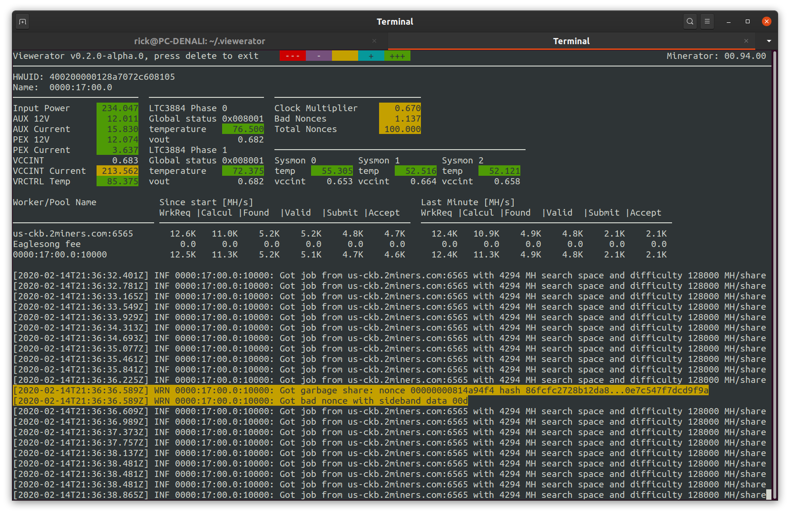

# viewerator

Console based Minerator viewer written in Rust




Minerator is a miner application for the FPGA based altcoin mining.  It provides a web based status which can be viewed on port 80
of the host which has the FPGA cards plugged into it.  For myself, I tend to ssh into a remote host and prefer the idea of a console
based status app so I only need on remote tunnel to both view and manipulate the host machine.

Viewerator is a console app which you can install in your /usr/local/bin directory and call when you ssh into your host. (It can be installed
anywhere as it is stand alone app).  

The terminal you run it in must be at least 126x26 characters in size.  No vt100's with 80x24 allowed. :)  If you have multiple cards, you
can select the displayed card selected 1-n where n is the last card. This will only work for your first 9 cards.

The /var/log/minerator.log is displayed at the bottom of the screen.  It is filtered per card, so when you select different cards, you
see the tail of the log as it applies to that card.

It is a work in progress and with all the normal caveats, use it and see if it is useful to you.

## Supported Features

- Displays Device DNAs of attached FGPAs
- Displays the min, max, and current temperature and voltage
- Displays running tail on /var/log/minerator.log, filtered to the current board
- Multiple board configurations (up to 8), including mixed BCU1525 and CVP13 combinations 

## Supported Xilinx FPGAs

- XCVU9P: SQRL BCU1525
- XCVU13P: Bittware CVP13

## Supported Platforms

- Linux (x86-64) running Minerator 00.94.00 or greater

## Installation

Styling an approach like the rust language itself, you should be able to install the latest version of viewerator on your ubuntu linux box
with the following command.  It downloads and copies the executable into the /usr/local/bin directory and keeps track of versions.  You will
need to enter your password (for sudo) when it is running for the copying to occur.  Copy and paste the following into a terminal window:

```bash
curl --proto '=https' --tlsv1.2 -sSf https://raw.githubusercontent.com/darval/viewerator/development/latest.sh | sh
```
